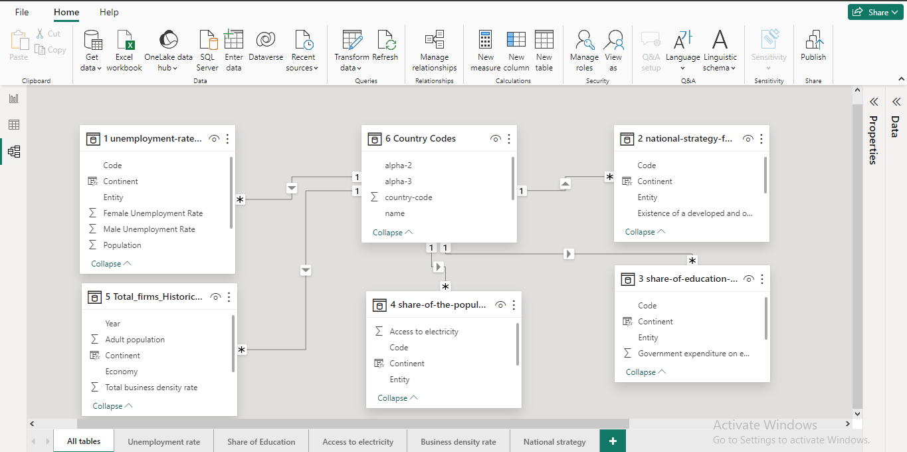

# Unraveling the Challenges of Unemployment in Africa

## Introduction
Unemployment remains one of the most daunting challenges facing African nations today. It is a multifaceted problem with deep roots in socio-economic, educational, and policy-related factors. This project leveraged Power BI to connect various datasets to uncover insights and strategies that could assist in mitigating the unemployment crisis in Africa.
The primary goal of this case study is to analyze data, identify patterns, and propose informed, data-driven recommendations that governments and stakeholders can implement to effectively address and reduce unemployment rates, particularly focusing on the African context.
## Skills demonstrated
The following Power BI skills were incorporated into this project:
- Data transformation using Power Query Editor.
- Data modeling on Power BI.
- Knowledge of DAX functions. RELATED, VAR, RETURN, FORMAT, IF, CALCULATE, and SELECTEDVALUE were among the notable functions used in this project.
- Data visualization on Power BI.
## Data sourcing
This project was done as participation in the Data Hackathon organized by 10Analytics on December 2nd & 3rd, 2023. Hence the [data sets](https://1drv.ms/u/s!AtAJMpFe5Cy_1AKmx2H66xZyrKrp?e=I0xyBJ) were provided to interested participants by the organizers. A total of 6 data sets were provided containing the unemployment rate among the male and female population, the national strategy for youth unemployment, the share of education in the government's expenditure, the share of the population with access to electricity, the total business density rate, and the code for each country.
## Data cleaning and transformation
All records containing null values in the unemployment rate column of the corresponding data set were dropped. Similarly, unemployment records with invalid year values were also dropped. The male and female unemployment rates were converted to percentages for ease of understanding and each data set was filtered for a closer look at African countries.
## Data modeling
The model is a star schema. A one-to-many relationship exists between the data set containing the country codes (dimension table) and each of the other data sets (fact tables). The relationship between the data sets can be seen below.

## Analysis
Analysis revealed that over the period, Lesotho had the highest unemployment rate (23.55%) among the male population while Djibouti had the highest female unemployment rate (36.89%) of any African country. A scatter plot indicated a very weak negative relationship between the average population of each gender and the average unemployment rate. Additionally, by comparing the percentage of the government's expenditure on education, the percentage of the population with access to electricity, and the total business density rate of the countries with the corresponding unemployment rates by gender, an unexpected insight was observed revealing that these factors did not influence the unemployment rates.
## Visualization
The data was visualized on a single dashboard which toggles to provide a closer look at unemployment from a gendered basis. A clear image of the interactive dashboard can be seen below while the full report on Power BI service can be interacted with [here]().

## Recommendations

